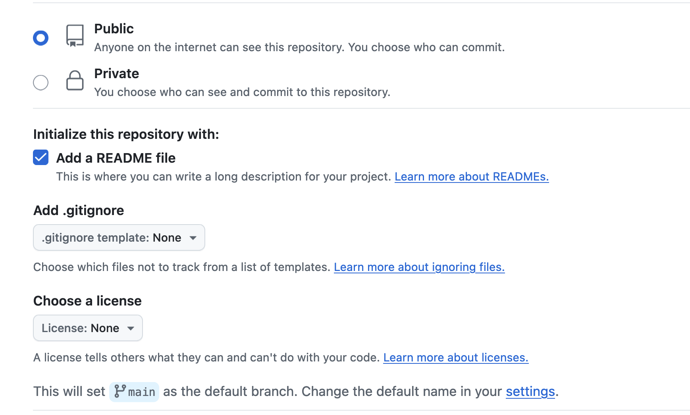
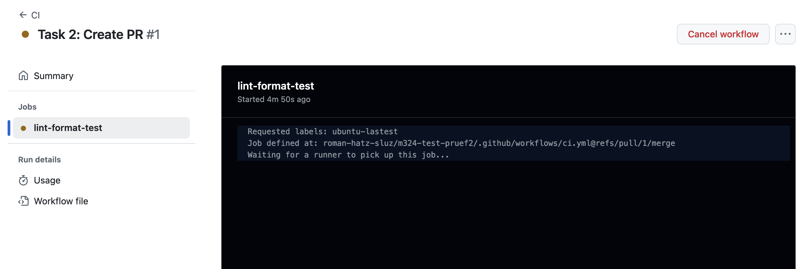
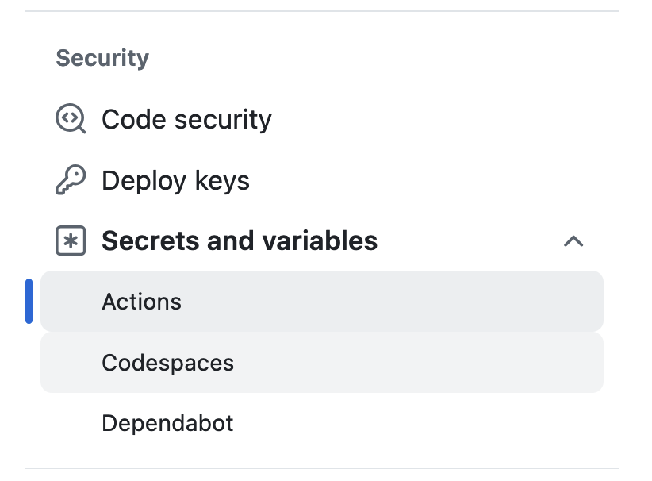
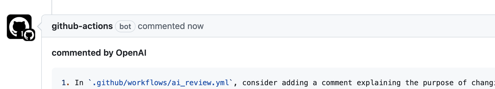
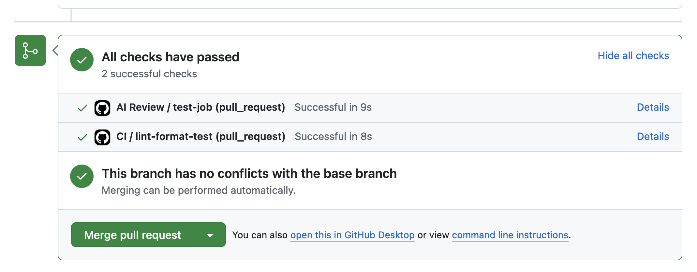

# ict-m324 -Prüfungsaufgabe: GitHub Actions und CI/CD  

---


- Achten Sie auf die geforderten Commit Messages. Bei jeder Aufgabe muss ein Commit mit einer bestimmten Nachricht erstellt werden.
- Lösen Sie die die Aufgaben 1 bis 3. Bei den Aufgaben 4 und 5 können Sie die Reihenfolge selber wählen.

## Aufgabe 1: Repository erstellen und Code übernehmen

1. **Neues Repository auf GitHub anlegen**

   - Erstellen Sie ein neues öffentliches Repository mit dem Namen `pruefung2_m324_VORNAME_NACHNAME`.
   - Achten Sie darauf, dass das Repository einen Branch namens `main` hat.
     

2. **Code übernehmen**

   - Öffnen Sie ihr Repository lokal.
   - Kopieren Sie alle Dateien aus von diesem Repository in ihr lokales Repository. Erstellen Sie keinen Fork. 
   - Erstellen Sie einen Commit mit der Nachricht `"Init"` und pushen Sie den Code auf GitHub. Ihr `main` Branch sollte denselben Code wie dieses Repository enthalten.
   - **Commit Messages**:
     - `"Init"`

---

## Aufgabe 2: Branch erstellen und Pull Request öffnen

1. Leiten Sie einen neuen Branch namens `exam` vom `main` Branch ab.
2. Fügen Sie eine leere Datei mit dem Namen `README_Aufgabe4.md` hinzu. Erstellen Sie einen Commit mit der Message `"Task 2: Create PR"`, pushen Sie den Branch `exam` und erstellen Sie einen **Pull Request** auf GitHub.com.

- **Commit Messages**:

  - `"Task 2: Create PR"`

  **Wichtig:**

  - Der Code im `main` Branch bleibt unverändert. Fügen Sie alle Änderungen an der Vorlage nur im Branch `exam` hinzu.
  - Lassen Sie den Pull Request bei der Abgabe offen.

---

## Aufgabe 3: Fehler im CI-Workflow beheben

Ihr Pull Request auf github.com sollte anzeigen, dass der Workflow startet.
Allerdings gibt es einen Fehler, der dazu führt, dass der Workflow nicht richtig gestartet werden kann. Es sollte so aussehen wie im Bild:


1. **Fehler im CI-Workflow beheben**

- In der YML Datei sind 2 Fehler eingebaut. Tipp: Vergleichen Sie die Datei mit der Vorlage aus der Prüfungsvorbereitung.
- Beheben Sie beide Fehler in der YML Datei und erstellen Sie jeweils einen Commit.
- **Commit Messages**:

  - `"Task 3: Fixed CI Error 1"`
  - `"Task 3: Fixed CI Error 2"`

- Der Workflow sollte auf github.com jetzt starten, es gibt jedoch einen Fehler beim Linter. Fixen Sie den Fehler und erstellen Sie einen Commit.
- **Commit Messages**:
  - `"Task 3: Fixed Linter Error"`
- Prüfen Sie mit `npm run format-check, ob Formatierungsfehler vorliegen. Falls nein, erzeugen Sie einen Fehler. Der Fehler soll zu einem Abbruch der GitHub Action führen. Entfernen Sie den Formatierungsfehler anschliessend wieder.
- **Commit Messages**:
  - `"Task 3: Add formatting error"`
    `"Task 3: Fix formatting error"`
- Der Workflow sollte jetzt funktionieren und die Nachricht "All checks have passed" anzeigen.

2. **Verbesserung der Paketinstallation**
   - Ersetzen Sie `run: npm install` durch eine bessere Variante, um einen reproduzierbaren Build sicherzustellen.
   - **Commit Message**:
     - `"Task 3: Improved package installation"`

---

## Aufgabe 4: Zusätzliche GitHub Action hinzufügen

- Fügen Sie eine beliebige GitHub Action vom Marketplace hinzu.
- Die Action muss funktionieren und etwas sinnvolles machen im gegebenen Code.
- Dokumentation schreiben: Verwenden Sie die Datei `README_Aufgabe4.md`aus Aufgabe 2 und beschreiben Sie in 1-2 vollständigen Sätzen, was ihre Action macht und welchen praktischen Nutzen sie für CI/CD bietet.
- Tipp: Haben Sie im IPT Modul eine eigene Action entwickelt, die Sie nutzen können?
- **Commit Messages**:
  - Alle Commits zu dieser Aufgabe müssen mit `"Task 4:"` beginnen.

---

## Aufgabe 5: KI-Code-Review einrichten

- Verwenden Sie [diese Action](https://github.com/marketplace/actions/ai-code-review-action), um ein KI-generiertes Code-Review zu Ihrem Pull Request zu erhalten.
- OPENAI_API_KEY: den Key finden Sie im Abgabeformular.
- Ein Secret geben Sie bei GitHub bei den Settings ein:
  

  **Parameter für die Action:**

  ```yaml
  OPENAI_API_KEY: ${{secrets.OPENAI_API_KEY}}
  open_ai_model: gpt-3.5-turbo
  with-comment: true
  ```

- Am Schluss sollte es ungefähr so aussehen:
  
  

- **Commit Messages**:

  - Alle Commits zu dieser Aufgabe müssen mit `"Task 5:"` beginnen.
